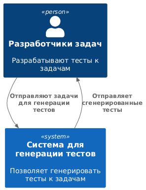
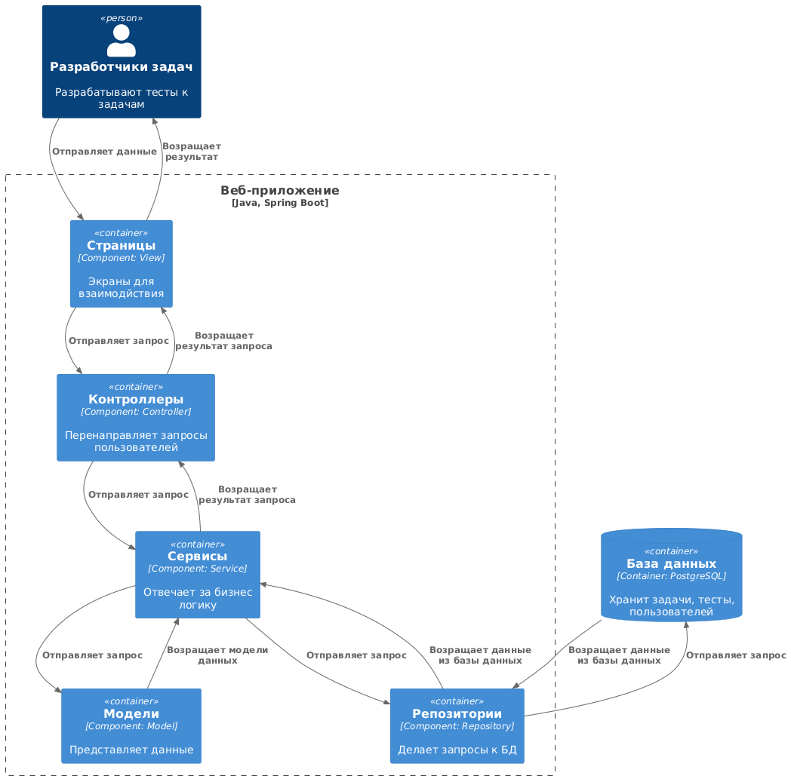
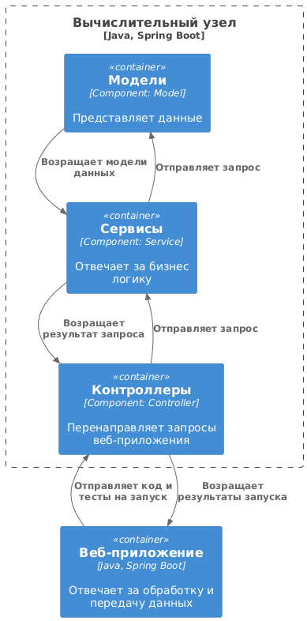

# Диаграмма системного контекста


```PlantUML
@startuml
!include <C4/C4_Container>

Person(personAlias, "Разработчики задач", "Разрабатывают тесты к задачам")

System(systemAlias, "Система для генерации тестов", "Позволяет генерировать тесты к задачам")

Rel(personAlias, systemAlias, "Отправляют задачи для генерации тестов", "")
Rel(systemAlias, personAlias, "Отправляет сгенерированные тесты", "")

@enduml
```
# Диаграмма контейнеров с пояснениями по выбору базового архитектурного стиля / архитектуры уровня приложений
## Выбор архитектурного стиля
**Архитектурный стиль**: Микросервисная архитектура.
Обоснование:
1. **Есть несколько ключевых модулей**: основное приложение (веб-приложение + бд), вычислительные узлы для выполнения кода.
Каждый из этих компонентов имеет четко определенную зону ответственности. 
Микросервисы позволяют разделить их как независимые службы, что упрощает разработку, развертывание и поддержку.
2. **Масштабируемость**: если нагрузка возрастает, можно добавить новые вычислительные узлы.
Основное приложение и система выполнения кода могут масштабироваться независимо друг от друга.
3. **Простота обновлений и расширений**: если в будущем потребуется добавить поддержку новых языков программирования, 
это можно сделать, добавив новый сервис-исполнитель, не затрагивая существующую архитектуру.
Микросервисы позволяют вносить изменения в одну службу без необходимости модификации всей системы.

## Выбор архитектуры уровня приложения
**Архитектура уровня приложения**: MVC (model-view-controller).
Обоснование:
1. **Разделение ответственности**: Архитектура MVC разделяет приложение на три ключевые компоненты:
Model (логика приложения и данные), View (пользовательский интерфейс), Controller (посредник между M и V).
Такое разделение позволяет упростить разработку и тестирование каждого компонента. Сделать код более понятным 
и поддерживаемы.
2. **Поддержка асинхронных операций**: MVC упрощает обработку асинхронных операций, разделяя логику.
3. **Масштабируемость и расширяемость**: Можно легко добавить новые функции. MVC хорошо масштабируется в микросервисной
архитектуре.
## Диаграмма контейнеров


```PlantUML
@startuml
!include <C4/C4_Container>

Person(personAlias, "Разработчики задач", "Разрабатывают тесты к задачам")

Container(systemAlias, "Веб-приложение",  "Java, Spring Boot", "Отвечает за обработку и передачу данных")

Container(node1, "Вычислительный узел 1", "Java, Spring Boot", "Запускает программы на тестах")
Container(node2, "Вычислительный узел 2", "Java, Spring Boot", "Запускает программы на тестах")

ContainerDb(db, "База данных", "PostgreSQL", "Хранит задачи, тесты, пользователей")

Rel(personAlias, systemAlias, "Отправляют задачи для генерации тестов", "")
Rel(systemAlias, personAlias, "Отправляет сгенерированные тесты", "")

Rel(db, systemAlias, "Получает задачи, тесты, пользователей", "")
Rel(systemAlias, db, "Отправляет задачи, тесты, пользователей", "")

Rel(node1, systemAlias, "Отправляет результаты запуска кода", "")
Rel(systemAlias, node1, "Отправляет тесты и код на запуск", "")

Rel(node2, systemAlias, "Отправляет результаты запуска кода", "")
Rel(systemAlias, node2, "Отправляет тесты и код на запуск", "")

@enduml
```
# Диаграмма компонентов для одного контейнера (веб-приложение)


```PlantUML
@startuml
!include <C4/C4_Container>

Person(personAlias, "Разработчики задач", "Разрабатывают тесты к задачам")

Boundary(c, "Веб-приложение", "Java, Spring Boot"){
Container(view, "Страницы",  "Component: View", "Экраны для взаимодйствия")
Container(model, "Модели",  "Component: Model", "Представляет данные")
Container(controller, "Контроллеры",  "Component: Controller", "Перенаправляет запросы пользователей")
Container(service, "Сервисы",  "Component: Service", "Отвечает за бизнес логику")
Container(repository, "Репозитории",  "Component: Repository", "Делает запросы к БД")
}
ContainerDb(db, "База данных", "Container: PostgreSQL", "Хранит задачи, тесты, пользователей")

Rel(personAlias, view, "Отправляет данные", "")
Rel(view, personAlias, "Возращает результат", "")

Rel(view, controller, "Отправляет запрос", "")
Rel(controller, view, "Возращает результат запроса", "")

Rel(controller, service, "Отправляет запрос", "")
Rel(service, controller, "Возращает результат запроса", "")

Rel(service, model, "Отправляет запрос", "")
Rel(model, service, "Возращает модели данных", "")

Rel(service, repository, "Отправляет запрос", "")
Rel(repository, service, "Возращает данные из базы данных", "")

Rel(repository, db, "Отправляет запрос", "")
Rel(db, repository, "Возращает данные из базы данных", "")

@enduml
```
# Диаграмма компонентов для другого контейнера (вычислительный узел)


```PlantUML
@startuml
!include <C4/C4_Container>

Container(systemAlias, "Веб-приложение",  "Java, Spring Boot", "Отвечает за обработку и передачу данных")

Boundary(c, "Вычислительный узел", "Java, Spring Boot") {
Container(model, "Модели",  "Component: Model", "Представляет данные")
Container(controller, "Контроллеры",  "Component: Controller", "Перенаправляет запросы веб-приложения")
Container(service, "Сервисы",  "Component: Service", "Отвечает за бизнес логику")
}


Rel(systemAlias, controller, "Отправляет код и тесты на запуск", "")
Rel(controller, systemAlias, "Возращает результаты запуска", "")

Rel(controller, service, "Отправляет запрос", "")
Rel(service, controller, "Возращает результат запроса", "")

Rel(service, model, "Отправляет запрос", "")
Rel(model, service, "Возращает модели данных", "")

@enduml
```
