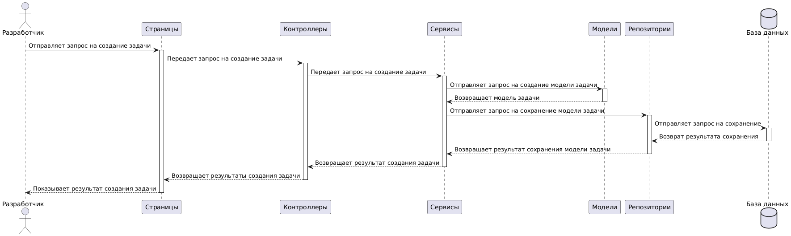
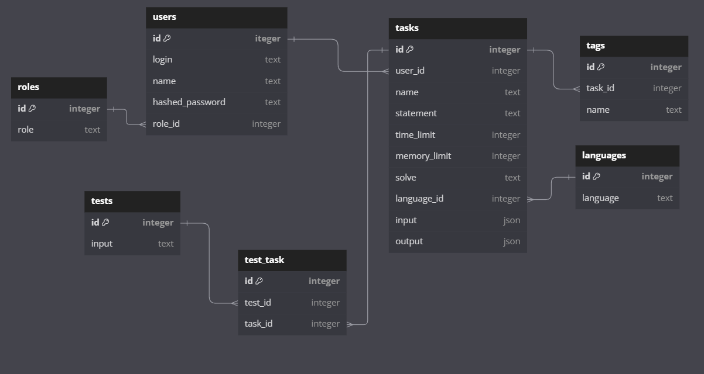

# Диаграмма контейнеров 


# Диаграмма компонентов (для веб-приложения)


# Диаграмма последовательностей
Вариант использования: Разработчик задач создает задачу в нашем приложении.

Краткие пояснения к диаграмме последовательной:
1. `Разработчик` отправляет запрос на создание задачи `Страницам`.
2. `Страницы` отправляет запрос к `Контроллерам`.
3. `Контроллеры` передают запрос `Сервисам`.
4. `Севрисы` создают модель задачи в `Модели` для `Базы данных`.
5. `Модели` возвращают `Сервисам` модель задачи.
6. `Сервисы` делают запрос в `Базу данных` для сохранения модели задачи.
7. `База данных` возвращает результат сохранения модели задачи `Сервису`.
8. `Сервисы` передают результат работы `Контроллерам`.
9. `Контроллеры` переедают результаты `Странице`.
10. `Страница` показывает результат `Разработчику`

<details><summary>Описание Схемы</summary>

```
actor "Разработчик " as Developer
participant "Страницы" as View
participant "Контроллеры" as Controller
participant "Сервисы" as Service
participant "Модели" as Model
participant "Репозитории" as Repository
database "База данных" as Database

Developer -> View: Отправляет запрос на создание задачи
activate View

View -> Controller: Передает запрос на создание задачи
activate Controller

Controller -> Service: Передает запрос на создание задачи
activate Service

Service -> Model: Отправляет запрос на создание модели задачи
activate Model
Model --> Service: Возвращает модель задачи
deactivate Model

Service -> Repository: Отправляет запрос на сохранение модели задачи
activate Repository

Repository -> Database: Отправляет запрос на сохранение
activate Database
Database --> Repository: Возврат результата сохранения
deactivate Database

Repository --> Service: Возвращает результат сохранения модели задачи
deactivate Repository

Service --> Controller: Возвращает результат создания задачи
deactivate Service

Controller --> View: Возвращает результаты создания задачи
deactivate Controller

View --> Developer: Показывает результат создания задачи
deactivate View
```
</details>

# Модель БД


<details><summary>Описание Схемы</summary>

```
Table users {
  id iteger [primary key]
  login text
  name text
  hashed_password text
  role_id integer
}

Table roles {
  id integer [primary key]
  role text
}

Table tasks {
   id integer [primary key]
   user_id integer 
   name text
   statement text
   time_limit integer
   memory_limit integer
   solve text
   language_id integer
   input json
   output json
}

Table languages {
   id integer [primary key]
   language text
}

Table tests {
  id integer [primary key]
  input text
}

Table test_task {
  id integer [primary key]
  test_id integer
  task_id integer
}

Table tags {
  id integer [primary key]
  task_id integer
  name text
}

Ref: users.role_id > roles.id
Ref: tasks.user_id > users.id
Ref: tasks.language_id > languages.id
Ref: test_task.test_id > tests.id
Ref: test_task.task_id > tasks.id
Ref: tags.task_id > tasks.id
```
</details>

# Применение основных принципов разработки
Код можно увидеть в папке code. Здесь будут описаны только основные моменты, где были применены принципы.

## KISS
Код должен быть "простым". Так и получилось. Все методы довольно короткие и понятные.

## YAGNI
Было сделано только самое необходимое. Ничего лишнего не было добавлено.

## DRY
Нигде не повторяется логика. Я не прописываю одну и ту же логику несколько раз.

## SOLID
### S
Каждый класс имеет только одну ответственность. Классы с бизнес логикой - отвечают только за нее, 
классы для работы с бд - отвечают за нее и т.д. 

### O
Я могу, например, добавить новую роль пользователей, не изменяя никак класс пользователей. 

### L
В моделях я использую List - интерфейс для разных реализаций лист. Можно в нее подставить, например, ArrayList.

### I
У меня нет крупных интерфейсов. Все методы интерфейсов используют их "клиенты".

### D
В `TaskController` я использую интерфейс `ITaskService`. Механизмы Java уже подставляют туда `TaskService`. 

# Дополнительные принципы разработки

## BDUF
### Описание:
Полное проектирование всей системы до начала разработки. Это означает, что архитектура,
бизнес-логика и интерфейсы тщательно продумываются заранее.
### Мой выбор: ОТКАЗ
По идее наша ВКР идет по waterflow, а не agile, поэтому стоит следовать данному принципу. Однако в реальности я, скорее
всего, не буду применять его, потому что всегда все идет не по плану. Стоит выбрать более адаптивные принципы.

## SoC
### Описание:
SoC требует разделения кода на независимые части, каждая из которых отвечает за свою конкретную задачу.

### Мой выбор: ПРИНИМАЮ
Этот принцип идеально подходит моему приложению. Я и так его уже соблюдаю: разбиваю код на controller, service и т.д.

## MVP
### Описание:
MVP – это подход, при котором создается минимально жизнеспособная версия продукта, включающая только основные функции,
для тестирования гипотез и получения обратной связи.

### Мой выбор: ПРИНИМАЮ
MVP позволит получить хоть сколько-то работающее приложение. Больше шансов прийти на защиту диплома с чем-то.

## PoC
### Описание:
PoC – это прототип, цель которого продемонстрировать реализуемость концепции.
Здесь важна проверка работоспособности ключевой идеи или технологии.

### Мой выбор: ОТКАЗ
Принцип требует времени, которое могло бы быть потрачено на прямую разработку. При этом у меня уже есть требования,
которые необходимо удовлетворить. Принцип избыточен в рамках моего проекта.