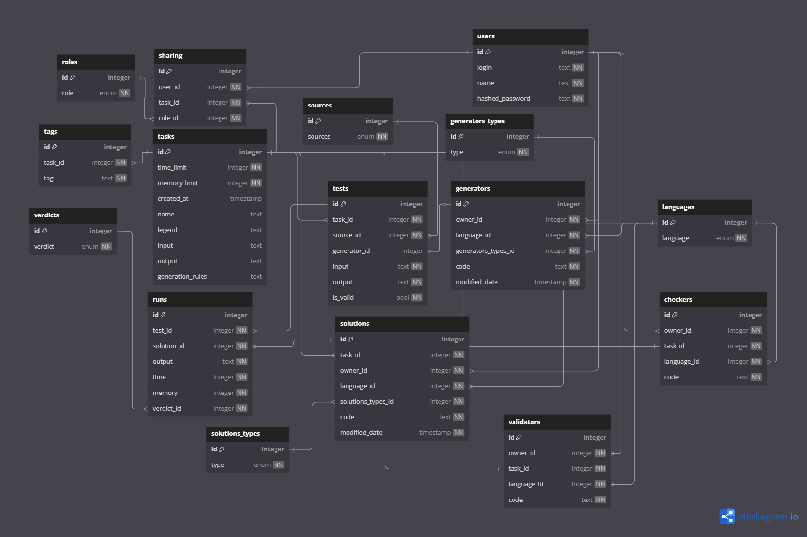

# 0. Текущая версия БД

Подробнее можно почитать [здесь](model.md) 
В рамках данной работы я использую `Task` и сокращенную версию `Test`
# 1. Микросервисы
В рамках данной работы я затронул 3 микросервиса: 
1. Менеджер задач (`web-backend`) - CRUD для `task` с вызовом 2 и 3 микросервисов. Пользователь взаимодействует системой через данный
микросервис. В текущей версии реализовано только создание задач. 
   Доступен по ссылке: `http://localhost:8081/web`
2. Генерация тестов (`generator-service`) - менеджер задач отправляет запрос этому микросервису на генерацию тестов. 
В текущей версии генерируется случайные тесты.
   Доступен по ссылке: `http://localhost:8082/generator`
3. Экспорт тестов (`export-service`) - менеджер задач отправляет запрос этому микросервису на экспорт данных. В текущей версии экспорт
представляет собой упаковку тестовых данных в zip архив, при этом каждый тест в своем .txt файле. 
   Доступен по ссылке: `http://localhost:8083/export`
# 2. Use case
В рамках данной работы пользователь:
1. Создает задачу.
2. Генерирует для нее тесты.
3. Экспортирует тесты.
