# Лабораторная работа №6
# GoF
## Порождающие шаблоны (3/3)
### Строитель (Builder) (1/3)
#### Назначение: 
Позволяет пошагово создавать сложные объекты (например, сущности с большим числом полей)
#### UML:
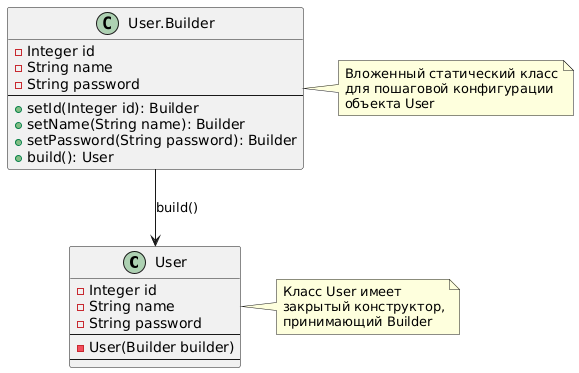
#### Код и пример:
```java
public class User {
    private final Integer id;
    private final String name;
    private final String password;

    private User(Builder builder) {
        this.id = builder.id;
        this.name = builder.name;
        this.password = builder.password;
    }

    public static class Builder {
        private Integer id;
        private String name;
        private String password;

        public Builder setId(Integer id) {
            this.id = id;
            return this;
        }
        public Builder setName(String name) {
            this.name = name;
            return this;
        }
        public Builder setPassword(String password) {
            this.password = password;
            return this;
        }
        public User build() {
            return new User(this);
        }
    }
}
```
Пример использования
```java
User user = new User.Builder()
                .setId(1)
                .setName("User")
                .setPassword("Pass")
                .build();
```

### Одиночка (Singleton) (2/3)
#### Назначение: 
Гарантирует, что класс имеет только один экземпляр и предоставляет глобальную точку доступа к нему.
#### UML:
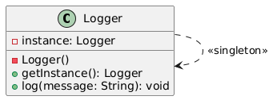
#### Код и пример:
```java
public class Logger { 
    private static Logger instance;

    // Приватный конструктор предотвращает создание экземпляров извне
    private Logger() {
    }

    // Метод для получения единственного экземпляра
    public static Logger getInstance() {
        if (instance == null) {
            instance = new Logger();
        }
        return instance;
    }

    // Метод для записи логов
    public void log(String message) {
        System.out.println("LOG: " + message);
    }
}
```
Пример
```java
Logger logger = Logger.getInstance();
logger.log("log1");
```
### Фабричный метод (Factory Method) (3/3)
#### Назначение:
Позволяет делегировать создание объектов подклассам, абстрагируя клиента от конкретных классов создаваемых объектов.
Это особенно полезно, когда система должна работать с разными типами сущностей, например,
создавать задачи (`Task`) с различной логикой. В данном примере фабрика создаёт объекты типа `Task`
(конкретно – `SimpleTask`) на основе переданных параметров.
#### UML:
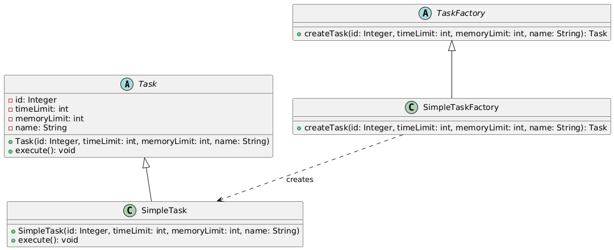
#### Код и пример:
```java
// Абстрактный класс Task
public abstract class Task {
    protected Integer id;
    protected int timeLimit;
    protected int memoryLimit;
    protected String name;

    public Task(Integer id, int timeLimit, int memoryLimit, String name) {
        this.id = id;
        this.timeLimit = timeLimit;
        this.memoryLimit = memoryLimit;
        this.name = name;
    }

    public abstract void execute();
}

// Конкретный класс задачи
class SimpleTask extends Task {
    public SimpleTask(Integer id, int timeLimit, int memoryLimit, String name) {
        super(id, timeLimit, memoryLimit, name);
    }

    @Override
    public void execute() {
        System.out.println("Executing simple task: " + name);
    }
}

// Абстрактная фабрика для создания задач
abstract class TaskFactory {
    public abstract Task createTask(Integer id, int timeLimit, int memoryLimit, String name);
}

// Конкретная фабрика для создания простых задач
class SimpleTaskFactory extends TaskFactory {
    @Override
    public Task createTask(Integer id, int timeLimit, int memoryLimit, String name) {
        return new SimpleTask(id, timeLimit, memoryLimit, name);
    }
}
```
Пример
```java
TaskFactory factory = new SimpleTaskFactory();
Task task = factory.createTask(1, 1000, 256, "Sample Task");
task.execute();
```
## Структурные шаблоны (4/4)
### Адаптер (Adapter) (1/4)
#### Назначение:
Позволяет преобразовывать интерфейс одного класса в интерфейс другого, который ожидают клиенты.
В контексте работы с доменными объектами и DTO (Data Transfer Objects) адаптер удобно использовать для
преобразования (маппинга) между внутренней моделью и внешним представлением данных.
Это помогает изолировать бизнес-логику от деталей представления и облегчает модификацию API
без изменения основной логики приложения.
#### UML:
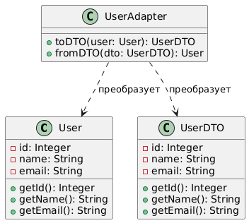
#### Код и пример:
```java
// Доменная модель
public class User {
    private final Integer id;
    private final String name;
    private final String password;

    public User(Integer id, String name, String password) {
        this.id = id;
        this.name = name;
        this.password = password;
    }

    public Integer getId() {
        return id;
    }

    public String getName() {
        return name;
    }

    public String getPassword() {
        return password;
    }
}

public class UserDTO {
    private Integer id;
    private String name;
    private String password;

    public UserDTO(Integer id, String name, String password) {
        this.id = id;
        this.name = name;
        this.password = password;
    }

    public Integer getId() {
        return id;
    }

    public String getName() {
        return name;
    }

    public String getPassword() {
        return password;
    }
}

// Адаптер для преобразования между User и UserDTO
public class UserAdapter {
    public static UserDTO toDTO(User user) {
        return new UserDTO(user.getId(), user.getName(), user.getPassword());
    }

    public static User fromDTO(UserDTO dto) {
        return new User(dto.getId(), dto.getName(), dto.getPassword());
    }
}
```
Пример
```java
UserDTO userDTO = new UserDTO(1,"us1","e1");
User user = UserAdapter.fromDTO(userDTO);
```
### Декоратор (Decorator) (2/4)
#### Назначение:
Позволяет динамически добавлять объектам новые обязанности, оборачивая их в декораторы,
которые расширяют базовую функциональность без изменения исходного класса. В этом примере базовый сервис выполняет
некоторую операцию, а декоратор добавляет логирование до и после вызова этой операции.
#### UML:
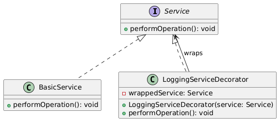
#### Код и пример:
```java
// Определяем интерфейс для сервиса
public interface Service {
    void performOperation();
}

// Базовая реализация сервиса
public class BasicService implements Service {
    @Override
    public void performOperation() {
        System.out.println("Выполнение базовой операции.");
    }
}

// Декоратор, добавляющий функциональность логирования
public class LoggingServiceDecorator implements Service {
    private final Service wrappedService;

    public LoggingServiceDecorator(Service service) {
        this.wrappedService = service;
    }

    @Override
    public void performOperation() {
        System.out.println("Лог: Начало операции.");
        wrappedService.performOperation();
        System.out.println("Лог: Завершение операции.");
    }
}
```
Пример
```java
Service service = new BasicService();
Service loggingService = new LoggingServiceDecorator(service);
loggingService.performOperation();
```

### Мост (Bridge) (3/4)
#### Назначение:
Позволяет разделить абстракцию и её реализацию. Это даёт возможность независимо изменять логику задачи и способ её исполнения.
В данном примере абстракция `Task` содержит общие параметры (идентификатор, ограничения, имя и т.д.) и делегирует
выполнение объекту-исполнителю (`TaskExecutor`). При этом можно легко переключаться между разными реализациями:
локальным исполнителем или удалённым.
#### UML:
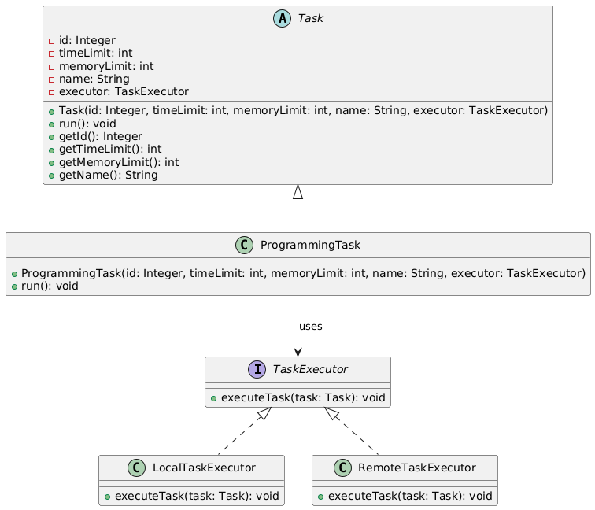
#### Код и пример:
```java
public interface TaskExecutor {
    void executeTask(Task task);
}

public abstract class Task {
    protected Integer id;
    protected int timeLimit;
    protected int memoryLimit;
    protected String name;
    protected TaskExecutor executor;

    public Task(Integer id, int timeLimit, int memoryLimit, String name, TaskExecutor executor) {
        this.id = id;
        this.timeLimit = timeLimit;
        this.memoryLimit = memoryLimit;
        this.name = name;
        this.executor = executor;
    }

    // Метод, вызывающий выполнение задачи через мост (исполнителя)
    public void run() {
        executor.executeTask(this);
    }
    
    public Integer getId() { return id; }
    public int getTimeLimit() { return timeLimit; }
    public int getMemoryLimit() { return memoryLimit; }
    public String getName() { return name; }
}

public class ProgrammingTask extends Task {
    public ProgrammingTask(Integer id, int timeLimit, int memoryLimit, String name, TaskExecutor executor) {
        super(id, timeLimit, memoryLimit, name, executor);
    }
}

public class LocalTaskExecutor implements TaskExecutor {
    @Override
    public void executeTask(Task task) {
        System.out.println("Выполняем задачу \"" + task.getName() + "\" локально.");
    }
}

public class RemoteTaskExecutor implements TaskExecutor {
    @Override
    public void executeTask(Task task) {
        System.out.println("Выполняем задачу \"" + task.getName() + "\" на удалённом сервере.");
    }
}
```
Пример
```java
// Использование локального исполнителя
TaskExecutor localExecutor = new LocalTaskExecutor();
Task localTask = new ProgrammingTask(1, 1000, 256, "Проверка входных данных", localExecutor);
localTask.run();

// Использование удалённого исполнителя
TaskExecutor remoteExecutor = new RemoteTaskExecutor();
Task remoteTask = new ProgrammingTask(2, 2000, 512, "Обработка задачи", remoteExecutor);
remoteTask.run();
```

### Фасад (Facade) (4/4)
#### Назначение:
Предоставляет унифицированный и упрощённый интерфейс для набора сложных подсистем. Позволяет скрыть сложность системы
путём сведения всех возможных внешних вызовов к одному объекту, делегирующему их соответствующим объектам системы.
#### UML:
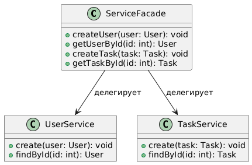
#### Код и пример
```java
public class User {
    private int id;
    private String login;
    private String name;
    private String hashedPassword;

    public User(int id, String login, String name, String hashedPassword) {
        this.id = id;
        this.login = login;
        this.name = name;
        this.hashedPassword = hashedPassword;
    }

    public int getId() {
        return id;
    }

    public String getLogin() {
        return login;
    }

    public String getName() {
        return name;
    }

    public String getHashedPassword() {
        return hashedPassword;
    }

    @Override
    public String toString() {
        return "User{id=" + id + ", login='" + login + "', name='" + name + "'}";
    }
}

public class Task {
    private int id;
    private int timeLimit;
    private int memoryLimit;
    private String name;

    public Task(int id, int timeLimit, int memoryLimit, String name) {
        this.id = id;
        this.timeLimit = timeLimit;
        this.memoryLimit = memoryLimit;
        this.name = name;
    }

    public int getId() {
        return id;
    }

    public int getTimeLimit() {
        return timeLimit;
    }

    public int getMemoryLimit() {
        return memoryLimit;
    }

    public String getName() {
        return name;
    }

    @Override
    public String toString() {
        return "Task{id=" + id + ", name='" + name + "', timeLimit=" + timeLimit + ", memoryLimit=" + memoryLimit + "}";
    }
}

public class UserService {
    public void create(User user) {
        System.out.println("Создан пользователь: " + user);
    }

    public User findById(int id) {
        System.out.println("Поиск пользователя по id: " + id);
        return new User(id, "login" + id, "User" + id, "hashedPassword");
    }
}

public class TaskService {
    public void create(Task task) {
        System.out.println("Создана задача: " + task);
    }

    public Task findById(int id) {
        System.out.println("Поиск задачи по id: " + id);
        return new Task(id, 1000, 256, "Task" + id);
    }
}

public class ServiceFacade {
    private UserService userService;
    private TaskService taskService;

    public ServiceFacade() {
        this.userService = new UserService();
        this.taskService = new TaskService();
    }

    public void createUser(User user) {
        userService.create(user);
    }

    public User getUserById(int id) {
        return userService.findById(id);
    }

    public void createTask(Task task) {
        taskService.create(task);
    }

    public Task getTaskById(int id) {
        return taskService.findById(id);
    }
}
```
Пример
```java
ServiceFacade facade = new ServiceFacade();

// Создание и работа с пользователем
User user = new User(1, "johndoe", "John Doe", "hashedPassword123");
facade.createUser(user);
User foundUser = facade.getUserById(1);
System.out.println("Найден пользователь: " + foundUser);

// Создание и работа с задачей
Task task = new Task(1, 2000, 512, "Sample Task");
facade.createTask(task);
Task foundTask = facade.getTaskById(1);
System.out.println("Найден задача: " + foundTask);
```
## Поведенческие шаблоны (5/5)
### Команда (Command) (1/5)
#### Назначение:
Инкапсулирует запрос в виде объекта, позволяя параметризовать клиентов различными операциями, ставить запросы в очередь,
логировать их или поддерживать отмену действий.
#### UML:
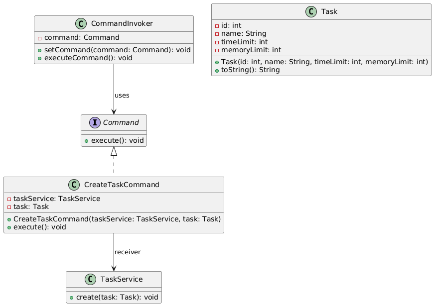
#### Код и пример
```java
// Интерфейс команды
public interface Command {
    void execute();
}

public class Task {
    private int id;
    private String name;
    private int timeLimit;
    private int memoryLimit;

    public Task(int id, String name, int timeLimit, int memoryLimit) {
        this.id = id;
        this.name = name;
        this.timeLimit = timeLimit;
        this.memoryLimit = memoryLimit;
    }

    @Override
    public String toString() {
        return "Task{id=" + id + ", name='" + name + "', timeLimit=" + timeLimit + ", memoryLimit=" + memoryLimit + "}";
    }
}

public class TaskService {
    public void create(Task task) {
        System.out.println("Создана задача: " + task);
    }
}

public class CreateTaskCommand implements Command {
    private TaskService taskService;
    private Task task;

    public CreateTaskCommand(TaskService taskService, Task task) {
        this.taskService = taskService;
        this.task = task;
    }

    @Override
    public void execute() {
        taskService.create(task);
    }
}

public class CommandInvoker {
    private Command command;

    public void setCommand(Command command) {
        this.command = command;
    }

    public void executeCommand() {
        if (command != null) {
            command.execute();
        }
    }
}
```
Пример
```java
// Создаём получателя операции
TaskService taskService = new TaskService();
// Создаём объект задачи
Task task = new Task(1, "Example Task", 1000, 256);
// Инкапсулируем запрос создания задачи в команду
Command createTaskCommand = new CreateTaskCommand(taskService, task);

// Передаём команду исполнителю (Invoker)
CommandInvoker invoker = new CommandInvoker();
invoker.setCommand(createTaskCommand);
invoker.executeCommand();
```

### Хранитель (Memento) (2/5)
#### Назначение:
Позволяет сохранить внутреннее состояние объекта без нарушения его инкапсуляции,
чтобы в дальнейшем иметь возможность восстановить его состояние.
Это полезно, например, для реализации функций отмены изменений (undo) или сохранения истории состояний.

#### UML:
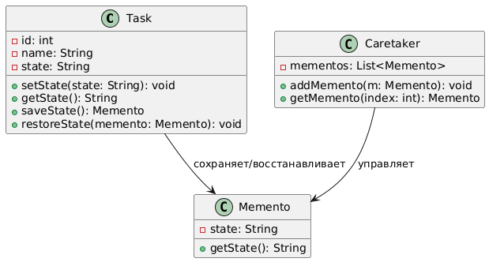
#### Код и пример
```java
public class Task {
    private int id;
    private String name;
    private String state; // Допустим, состояние задачи может изменяться

    public Task(int id, String name, String state) {
        this.id = id;
        this.name = name;
        this.state = state;
    }

    public void setState(String state) {
        this.state = state;
    }

    public String getState() {
        return state;
    }

    // Создание снимка текущего состояния
    public Memento saveState() {
        return new Memento(state);
    }

    public void restoreState(Memento memento) {
        this.state = memento.getState();
    }

    public static class Memento {
        private final String state;

        public Memento(String state) {
            this.state = state;
        }

        public String getState() {
            return state;
        }
    }
}

public class TaskHistory {
    private List<Task.Memento> mementos = new ArrayList<>();

    public void addMemento(Task.Memento memento) {
        mementos.add(memento);
    }

    public Task.Memento getMemento(int index) {
        if(index >= 0 && index < mementos.size()){
            return mementos.get(index);
        }
        throw new IndexOutOfBoundsException("Неверный индекс для восстановления состояния");
    }
}


```
Пример
```java
// Создаём объект Task с начальными данными
Task task = new Task(1, "Реализовать паттерн Memento", "Начальное состояние");
System.out.println("Текущее состояние: " + task.getState());

// Создаём объект-хранитель для снимков состояния
TaskHistory history = new TaskHistory();

// Сохраняем состояние
history.addMemento(task.saveState());

// Изменяем состояние объекта
task.setState("Состояние после первого изменения");
System.out.println("Изменённое состояние: " + task.getState());

// Сохраняем новое состояние
history.addMemento(task.saveState());

// Ещё одно изменение
task.setState("Состояние после второго изменения"); 
System.out.println("Изменённое состояние: " + task.getState());
 
// Восстанавливаем первое сохранённое состояние
task.restoreState(history.getMemento(0)); 
System.out.println("Восстановленное состояние: " + task.getState());
```

### Наблюдатель (Observer) (3/5)
#### Назначение:
Позволяет объекту–субъекту оповещать связанные объекты–наблюдатели об изменениях своего состояния.
Это полезно для реализации функционала уведомлений, логирования или обновления пользовательского интерфейса при
изменении состояния.

#### UML:
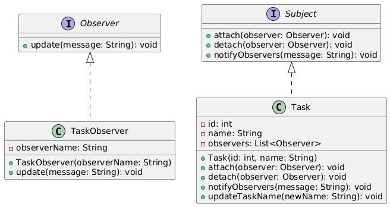
#### Код и пример
```java
// Интерфейс субъекта
public interface Subject {
    void attach(Observer observer);
    void detach(Observer observer);
    void notifyObservers(String message);
}

// Интерфейс наблюдателя
public interface Observer {
    void update(String message);
}

public class Task implements Subject {
    private int id;
    private String name;
    private List<Observer> observers = new ArrayList<>();

    public Task(int id, String name) {
        this.id = id;
        this.name = name;
    }

    @Override
    public void attach(Observer observer) {
        observers.add(observer);
    }

    @Override
    public void detach(Observer observer) {
        observers.remove(observer);
    }

    @Override
    public void notifyObservers(String message) {
        for (Observer observer : observers) {
            observer.update(message);
        }
    }

    // Метод для обновления имени задачи, который уведомляет наблюдателей
    public void updateTaskName(String newName) {
        this.name = newName;
        notifyObservers("Задача " + id + " изменила имя на: " + newName);
    }

    public int getId() {
        return id;
    }

    public String getName() {
        return name;
    }
}

public class TaskObserver implements Observer {
    private String observerName;

    public TaskObserver(String observerName) {
        this.observerName = observerName;
    }

    @Override
    public void update(String message) {
        System.out.println(observerName + " получил уведомление: " + message);
    }
}
```
Пример
```java
// Создаём задачу
Task task = new Task(1, "Начальная задача");

// Создаём наблюдателей
Observer observer1 = new TaskObserver("Наблюдатель 1");
Observer observer2 = new TaskObserver("Наблюдатель 2");

// Подписываем наблюдателей на уведомления задачи
task.attach(observer1);
task.attach(observer2);

// Обновляем задачу и наблюдатели получат уведомление
task.updateTaskName("Обновлённая задача");
```

### Стратегия (Strategy) (4/5)
#### Назначение:
Позволяет инкапсулировать семейство алгоритмов (стратегий) и делать их взаимозаменяемыми.
#### UML:
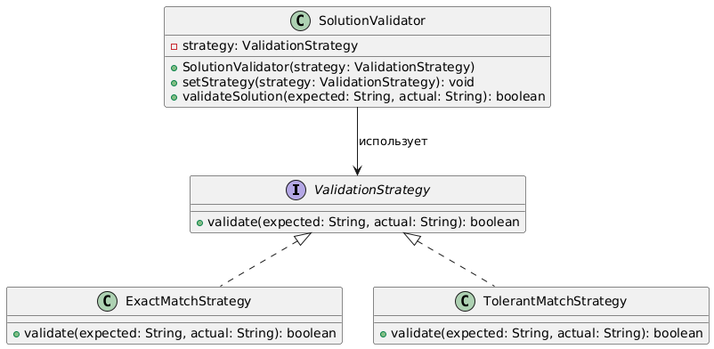
#### Код и пример
```java
public interface ValidationStrategy {
    boolean validate(String expected, String actual);
}

public class ExactMatchStrategy implements ValidationStrategy {
    @Override
    public boolean validate(String expected, String actual) {
        return expected.equals(actual);
    }
}

public class TolerantMatchStrategy implements ValidationStrategy {
    @Override
    public boolean validate(String expected, String actual) {
        String normalizedExpected = expected.trim().replaceAll("\\s+", " ");
        String normalizedActual = actual.trim().replaceAll("\\s+", " ");
        return normalizedExpected.equals(normalizedActual);
    }
}

public class SolutionValidator {
    private ValidationStrategy strategy;

    public SolutionValidator(ValidationStrategy strategy) {
        this.strategy = strategy;
    }

    public void setStrategy(ValidationStrategy strategy) {
        this.strategy = strategy;
    }

    public boolean validateSolution(String expected, String actual) {
        return strategy.validate(expected, actual);
    }
}
```
Пример
```java
String expected = "Hello, World!";
String actual1 = "Hello, World!";
String actual2 = "  Hello,   World!  ";

// Используем стратегию точного совпадения
ValidationStrategy exactMatch = new ExactMatchStrategy();
SolutionValidator validator = new SolutionValidator(exactMatch);

System.out.println("Exact match (actual1): " + validator.validateSolution(expected, actual1));
System.out.println("Exact match (actual2): " + validator.validateSolution(expected, actual2));

// Переключаем стратегию на терпимую (игнорирует лишние пробелы)
ValidationStrategy tolerantMatch = new TolerantMatchStrategy();
validator.setStrategy(tolerantMatch);

System.out.println("Tolerant match (actual1): " + validator.validateSolution(expected, actual1));
System.out.println("Tolerant match (actual2): " + validator.validateSolution(expected, actual2));
```

### Шаблонный метод (Template method) (5/5)
#### Назначение:
Задаёт скелет алгоритма в базовом классе, позволяя подклассам переопределять отдельные шаги алгоритма без изменения его общей структуры.
#### UML:
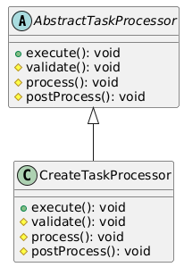
#### Код и пример
```java
public abstract class AbstractTaskProcessor {
    // Шаблонный метод, определяющий фиксированную последовательность шагов
    public final void execute() {
        validate();
        process();
        postProcess();
    }

    // Шаг валидации данных – обязательный для реализации подклассами
    protected abstract void validate();

    // Основной шаг обработки – обязательный для реализации подклассами
    protected abstract void process();

    // Дополнительный шаг, который можно переопределить при необходимости
    protected void postProcess() {
        System.out.println("Выполняется стандартная постобработка.");
    }
}

public class CreateTaskProcessor extends AbstractTaskProcessor {

    @Override
    protected void validate() {
        // Реализация проверки данных для создания задачи
        System.out.println("Проверка входных данных для создания задачи.");
    }

    @Override
    protected void process() {
        // Реализация логики создания задачи (например, сохранение в БД)
        System.out.println("Выполнение логики создания задачи.");
    }

    @Override
    protected void postProcess() {
        // Дополнительные действия после создания задачи (например, уведомление)
        System.out.println("Отправка уведомлений после создания задачи.");
    }
}
```
Пример
```java
// Используем конкретную реализацию шаблона для создания задачи
AbstractTaskProcessor taskProcessor = new CreateTaskProcessor();
taskProcessor.execute();
```
# GRASP
## Роли (обязанности) классов (5/5)
### Информационный эксперт (Information Expert) (1/5)
#### Проблема:
Какому классу поручить хранение и обработку данных, связанных с конкретной сущностью (например, задачей)?
#### Решение:
Класс, обладающий всей необходимой информацией о задаче, сам отвечает за её обработку.
#### Пример кода:
В классе `Task` методы `saveState()`/`restoreState()` работают с внутренними данными:
```java
public class Task {
    private int id;
    private String name;
    private String state;
    
    // ...
    
    public Memento saveState() {
        return new Memento(state);
    }

    public void restoreState(Memento memento) {
        this.state = memento.getState();
    }

    public static class Memento {
        private final String state;

        public Memento(String state) {
            this.state = state;
        }

        public String getState() {
            return state;
        }
    }
}
```
#### Результаты:
Повышается согласованность и правильное распределение обязанностей – класс `Task` знает о своей логике и состоянии.
Cоблюдается принцип инкапсуляции, уменьшается связанность классов.
#### Связь с другими паттернами:
Связан с паттернами Memento (сохранение состояния) и Template Method (фиксированная последовательность операций).

### Создатель (Creator) (2/5)
#### Проблема:
Кто должен создавать новые объекты?
#### Решение:
Использование фабричных методов и шаблона Builder для инкапсуляции логики создания объектов.
#### Пример кода:
##### Builder
```java
User user = new User.Builder()
                .setId(1)
                .setName("User")
                .setPassword("Pass")
                .build();
```
##### Factory method
```java
TaskFactory factory = new SimpleTaskFactory();
Task task = factory.createTask(1, 1000, 256, "Sample Task");
task.execute();
```
#### Результаты:
Упрощается создание объектов, код становится более гибким и расширяемым.
#### Связь с другими паттернами:
Тесно связан с паттернами Singleton (если требуется гарантировать один экземпляр) и Builder/Factory.

### Контроллер (Controller) (3/5)
#### Проблема:
Как организовать обработку внешних запросов, не перегружая представленные модели логикой взаимодействия с пользователем?
#### Решение:
Использование фасада (Facade) для делегирования запросов внутренним сервисам.
#### Пример кода:
```java
public class ServiceFacade {
    private UserService userService;
    private TaskService taskService;

    public ServiceFacade() {
        this.userService = new UserService();
        this.taskService = new TaskService();
    }

    public void createUser(User user) {
        userService.create(user);
    }

    public User getUserById(int id) {
        return userService.findById(id);
    }

    public void createTask(Task task) {
        taskService.create(task);
    }

    public Task getTaskById(int id) {
        return taskService.findById(id);
    }
}
```
#### Результаты:
Снижается связность между клиентским кодом и сложной внутренней структурой приложения;
появляется единый интерфейс для управления.
#### Связь с другими паттернами:
Связан с паттерном Фасад и Команда (Invoker передаёт команды).

### Чистая выдумка (Pure Fabrication) (4/5)
#### Проблема:
В некоторых случаях в предметной области нет естественных классов,
которые отвечали бы за служебные задачи (например, логирование, управление транзакциями, кэширование).
Если «нагружать» доменные классы такими обязанностями, их чистота и понятность снижается.
#### Решение:
Создать искусственный (вынужденный) класс, не связанный напрямую с предметной областью, для выполнения служебных функций.
Например, класс `Logger` реализует функцию логирования, не представляя бизнес-сущность,
но обеспечивая отделение служебных обязанностей от основной логики.
#### Пример кода:
```java
public class Logger { 
    private static Logger instance;
    
    private Logger() {
    }
    
    public static Logger getInstance() {
        if (instance == null) {
            instance = new Logger();
        }
        return instance;
    }
    
    public void log(String message) {
        System.out.println("LOG: " + message);
    }
}
```
#### Результаты:
Такой подход позволяет сохранить чистоту доменных классов, улучшить разделение обязанностей и облегчить сопровождение кода.
Служебные задачи вынесены в отдельный компонент, что снижает риск внесения ошибок в бизнес-логику.
#### Связь с другими паттернами:
Тесно связана с принципом SRP (каждый класс имеет единственную ответственность) и часто используется в паре с паттерном
Singleton (для создания единственного экземпляра, как в Logger).

### Перенаправление (Indirection) (5/5)
#### Проблема:
Прямое взаимодействие между компонентами может привести к сильной связанности,
что усложняет замену или модификацию отдельных частей системы.
#### Решение:
Ввести промежуточный класс или интерфейс, который будет служить посредником между двумя модулями.
Например, класс `ServiceFacade` выступает как промежуточное звено между клиентским кодом и конкретными сервисами (`UserService`, `TaskService`).

#### Пример кода:
```java
public class ServiceFacade {
    private UserService userService;
    private TaskService taskService;

    public ServiceFacade() {
        this.userService = new UserService();
        this.taskService = new TaskService();
    }

    public void createUser(User user) {
        userService.create(user);
    }

    public User getUserById(int id) {
        return userService.findById(id);
    }

    public void createTask(Task task) {
        taskService.create(task);
    }

    public Task getTaskById(int id) {
        return taskService.findById(id);
    }
}
```
#### Результаты:
Благодаря введению посредника (Indirection) снижается прямая зависимость клиентского кода от деталей реализации сервисов.
Это облегчает модификацию или замену отдельных подсистем без влияния на остальную систему.
#### Связь с другими паттернами:
Indirection часто используется вместе с паттерном Facade, Adapter или Command – все они создают дополнительный уровень
абстракции для уменьшения связанности между компонентами.

## Принципы разработки (3/3)
### Слабое (низкое) зацепление (Low Coupling) (1/3)
#### Проблема:
Высокая связанность между классами усложняет тестирование и модификацию кода, поскольку изменения в одном классе могут повлиять на множество других.

#### Решение:
Использование абстракций (интерфейсов, абстрактных классов) для взаимодействия между компонентами.
Например, классы, использующие стратегию валидации, зависят от интерфейса `ValidationStrategy`, а не от конкретных реализаций.

#### Пример кода:
```java
public interface ValidationStrategy {
    boolean validate(String expected, String actual);
}

public class ExactMatchStrategy implements ValidationStrategy {
    @Override
    public boolean validate(String expected, String actual) {
        return expected.equals(actual);
    }
}

public class TolerantMatchStrategy implements ValidationStrategy {
    @Override
    public boolean validate(String expected, String actual) {
        String normalizedExpected = expected.trim().replaceAll("\\s+", " ");
        String normalizedActual = actual.trim().replaceAll("\\s+", " ");
        return normalizedExpected.equals(normalizedActual);
    }
}

public class SolutionValidator {
    private ValidationStrategy strategy;

    public SolutionValidator(ValidationStrategy strategy) {
        this.strategy = strategy;
    }

    public void setStrategy(ValidationStrategy strategy) {
        this.strategy = strategy;
    }

    public boolean validateSolution(String expected, String actual) {
        return strategy.validate(expected, actual);
    }
}
```
#### Результаты:
Код становится модульным и легко расширяемым – компоненты можно заменять или модифицировать независимо, что упрощает поддержку системы.

#### Связь с другими паттернами:
Low Coupling является важной предпосылкой для паттернов, таких как Strategy, Adapter и Command, где взаимодействие происходит через абстракции.

### Сильная (высокая) связность (High Cohesion) (2/3)
#### Проблема:
Если класс выполняет слишком много разнообразных обязанностей, его логика становится запутанной, и код труднее поддерживать.
#### Решение:
Распределить ответственность так, чтобы каждый класс имел чётко определённую цель. Например, класс `TaskService` отвечает
только за операции с задачами, а класс `UserService` – только за операции с пользователями.
#### Пример кода:
```java
public class UserService {
    public void create(User user) {
        System.out.println("Создан пользователь: " + user);
    }

    public User findById(int id) {
        System.out.println("Поиск пользователя по id: " + id);
        return new User(id, "login" + id, "User" + id, "hashedPassword");
    }
}

public class TaskService {
    public void create(Task task) {
        System.out.println("Создана задача: " + task);
    }

    public Task findById(int id) {
        System.out.println("Поиск задачи по id: " + id);
        return new Task(id, 1000, 256, "Task" + id);
    }
}
```
#### Результаты:
Классы становятся более понятными и легко тестируемыми, так как каждая единица кода сфокусирована на узкой ответственности.

#### Связь с другими паттернами:
High Cohesion тесно сочетается с SRP и реализуется через разделение обязанностей в паттернах Facade, Command и Template Method.

### Полиморфизм (Polymorphism) (3/3)
#### Проблема:
Необходимость обрабатывать объекты различных типов без знания их конкретной реализации.

#### Решение:
Использовать полиморфизм через наследование и интерфейсы, что позволяет динамически выбирать нужное поведение.
Например, стратегия валидации (`ExactMatchStrategy`, `TolerantMatchStrategy`) реализует общий интерфейс `ValidationStrategy`,
и объект `SolutionValidator` может работать с любой из них.


#### Пример кода:
```java
public interface ValidationStrategy {
    boolean validate(String expected, String actual);
}

public class ExactMatchStrategy implements ValidationStrategy {
    @Override
    public boolean validate(String expected, String actual) {
        return expected.equals(actual);
    }
}

public class TolerantMatchStrategy implements ValidationStrategy {
    @Override
    public boolean validate(String expected, String actual) {
        String normalizedExpected = expected.trim().replaceAll("\\s+", " ");
        String normalizedActual = actual.trim().replaceAll("\\s+", " ");
        return normalizedExpected.equals(normalizedActual);
    }
}

public class SolutionValidator {
    private ValidationStrategy strategy;

    public SolutionValidator(ValidationStrategy strategy) {
        this.strategy = strategy;
    }

    public void setStrategy(ValidationStrategy strategy) {
        this.strategy = strategy;
    }

    public boolean validateSolution(String expected, String actual) {
        return strategy.validate(expected, actual);
    }
}
```
#### Результаты:
Клиентский код не зависит от конкретных реализаций алгоритмов – можно легко подменять стратегии,
расширяя функциональность без изменения существующего кода.
#### Связь с другими паттернами:
Полиморфизм является основой паттернов Strategy, Command и Adapter, позволяющих подменять реализации в зависимости от требований.


## Свойство программы (1/1)
### Устойчивость к изменениям (Protected Variations) (1/1)
#### Проблема:
Изменения в одной части системы (например, новый алгоритм валидации или другой способ выполнения задачи) могут негативно
сказаться на остальных компонентах, если они тесно связаны.

#### Решение:
Защитить варьирующиеся части системы посредством абстракций и паттернов, которые изолируют изменения.

#### Пример кода:
```java
public interface ValidationStrategy {
    boolean validate(String expected, String actual);
}

public class ExactMatchStrategy implements ValidationStrategy {
    @Override
    public boolean validate(String expected, String actual) {
        return expected.equals(actual);
    }
}

public class TolerantMatchStrategy implements ValidationStrategy {
    @Override
    public boolean validate(String expected, String actual) {
        String normalizedExpected = expected.trim().replaceAll("\\s+", " ");
        String normalizedActual = actual.trim().replaceAll("\\s+", " ");
        return normalizedExpected.equals(normalizedActual);
    }
}

public class SolutionValidator {
    private ValidationStrategy strategy;

    public SolutionValidator(ValidationStrategy strategy) {
        this.strategy = strategy;
    }

    public void setStrategy(ValidationStrategy strategy) {
        this.strategy = strategy;
    }

    public boolean validateSolution(String expected, String actual) {
        return strategy.validate(expected, actual);
    }
}
```

#### Результаты:
Система становится устойчивой к изменениям – новые реализации можно добавлять или заменять без изменения остального кода.
Это снижает риск ошибок при модификациях и упрощает поддержку в долгосрочной перспективе.
#### Связь с другими паттернами:
Protected Variations достигается через применение паттернов Strategy, Factory Method, Template Method и других,
которые вводят уровень абстракции и изоляции для варьирующихся элементов системы.